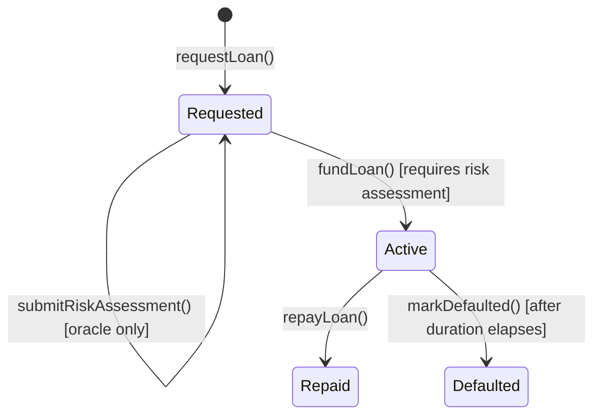

# `P2PLendingEscrow` Contract Reference

Location: [`contracts/P2PLendingEscrow.sol`](../../contracts/P2PLendingEscrow.sol)
Solidity: `^0.8.20` · OpenZeppelin Contracts `^5.6.1`

## Purpose

Escrows a single lender's ETH principal for a borrower until the loan is repaid with interest. The contract is the authoritative source of truth for loan state, funding, and repayment — matching the project rule that the frontend must never be trusted for financial accounting.

## Roles (OpenZeppelin `AccessControl`)

| Role                   | Granted to (constructor) | Purpose                     |
| ---------------------- | ------------------------ | --------------------------- |
| `DEFAULT_ADMIN_ROLE`   | deployer                 | Manage role membership      |
| `DEFAULT_MANAGER_ROLE` | deployer                 | Call `markDefaulted`        |
| `RISK_ORACLE_ROLE`     | deployer                 | Call `submitRiskAssessment` |
| `PAUSER_ROLE`          | deployer                 | Call `pause` / `unpause`    |

In production these roles should be transferred from the deployer to dedicated operational addresses (e.g., a multisig for `DEFAULT_MANAGER_ROLE`, the off-chain risk-scoring service's signer for `RISK_ORACLE_ROLE`).

## Loan Lifecycle (state machine)

- `requestLoan` — borrower opens a loan request within a tier's RM-equivalent cap. `riskScore` starts as a pending sentinel; it is **not** supplied by the borrower.
- `submitRiskAssessment` — only `RISK_ORACLE_ROLE` can attach the off-chain AI risk score and a `riskHash` commitment before the loan can be funded.
- `fundLoan` — any account except the borrower sends exactly `principal` in ETH; funds are forwarded to the borrower immediately and the loan becomes `Active`.
- `repayLoan` — the borrower repays `principal + interest` in one transaction; funds are forwarded to the lender and the loan becomes `Repaid`.
- `markDefaulted` — `DEFAULT_MANAGER_ROLE` can mark a loan `Defaulted` once `startTime + duration` has passed without repayment.

## Why Risk Score Is Not Borrower-Supplied

An earlier version of this contract let the borrower pass their own `riskScore` into `requestLoan()`, which meant anyone could self-report the lowest possible risk. That defeats the purpose of AI-driven risk scoring. The current design:

- Stores `riskScore` as a pending sentinel (`type(uint64).max`) until an account holding `RISK_ORACLE_ROLE` calls `submitRiskAssessment`.
- Stores a `riskHash` (`bytes32`) alongside the score — a cryptographic commitment to the off-chain risk payload, so the exact off-chain assessment can be audited later without putting PII or raw data on-chain.
- `fundLoan` reverts with `RiskAssessmentPending` if funding is attempted before an assessment is submitted.

This keeps the score's integrity tied to the trusted off-chain service (the `/predict-risk` API) instead of the borrower, consistent with `AGENTS.md`'s requirement to apply defined business rules rather than trusting a self-reported number.

## Tier Caps

| Tier   | RM range             | Enforced via             |
| ------ | -------------------- | ------------------------ |
| Tier 1 | RM 500 – RM 3,000    | `withinTierCap` modifier |
| Tier 2 | RM 3,001 – RM 15,000 | `withinTierCap` modifier |

The RM-equivalent of a principal is computed as `principal * rmPerEth / 1 ether`, where `rmPerEth` is an immutable value set at deployment (there is no live price oracle in this prototype — see [Known Limitations](#known-limitations)).

The two tier-specific modifiers from the initial implementation were merged into a single `withinTierCap(principal, tier)` modifier backed by a `_tierBounds(tier)` helper, removing duplicate bytecode and making it a single place to add a future tier.

## Validation Added Beyond the Original Draft

| Check                         | Constant                                             | Reason                                                                                                                                  |
| ----------------------------- | ---------------------------------------------------- | --------------------------------------------------------------------------------------------------------------------------------------- |
| Interest rate ceiling         | `MAX_INTEREST_RATE_BPS = 5_000` (50% APR)            | Prevents predatory or accidental extreme rates and bounds the interest math                                                             |
| Minimum/maximum duration      | `MIN_DURATION = 1 days`, `MAX_DURATION = 3_650 days` | Rejects zero-length or absurdly long loans                                                                                              |
| Principal fits packed storage | `principal <= type(uint96).max`                      | Defense-in-depth guard before downcasting into the packed struct (see below); prevents silent truncation if `rmPerEth` is misconfigured |
| Risk score bound              | `riskScore <= 1e18`                                  | Keeps the score in the same 0.0–1.0 scale (scaled to 18 decimals) used by the off-chain API                                             |

## Storage Layout (gas efficiency)

The original `Loan` struct used nine full 32-byte slots (every field, including the `LoanState` enum, occupied its own slot). The struct was reordered and narrowed to pack into **5 slots**:

| Slot | Fields                                                                                              |
| ---- | --------------------------------------------------------------------------------------------------- |
| 1    | `id` (`uint256`)                                                                                    |
| 2    | `borrower` (`address`) + `state` (`LoanState`, 1 byte)                                              |
| 3    | `lender` (`address`) + `principal` (`uint96`)                                                       |
| 4    | `interestRate` (`uint32`) + `duration` (`uint40`) + `startTime` (`uint40`) + `riskScore` (`uint64`) |
| 5    | `riskHash` (`bytes32`)                                                                              |

All narrowed integer types keep generous headroom above the values the business rules allow (e.g., `uint96` for principal, `uint40` for durations/timestamps — see inline comments in the contract). Every downcast (`uint96(principal)`, `uint32(interestRate)`, `uint40(duration)`, `uint64(riskScore)`) is preceded by an explicit bounds check so a value can never be silently truncated.

Fewer storage slots per loan means fewer `SSTORE` operations when a loan is created, funded, and repaid — the single largest gas-cost driver in this contract.

## Security Measures

- **Reentrancy:** `fundLoan` and `repayLoan` use OpenZeppelin's `ReentrancyGuard` and follow checks-effects-interactions — loan state is updated before the external ETH transfer.
- **Emergency stop:** `Pausable` is applied to `requestLoan`, `fundLoan`, and `repayLoan` via `whenNotPaused`. `PAUSER_ROLE` can `pause()`/`unpause()` if an exploit or oracle compromise is detected.
- **Access control:** `markDefaulted`, `submitRiskAssessment`, `pause`, and `unpause` are role-gated with OpenZeppelin `AccessControl`.
- **Custom errors:** all failure paths use custom errors (cheaper than revert strings, and machine-readable for tests/monitoring).
- **Exact-value funding/repayment:** `fundLoan` and `repayLoan` require the exact wei amount, rejecting both under- and over-payment rather than silently accepting or refunding a difference.

## Events

| Event                                              | Emitted when                                                |
| -------------------------------------------------- | ----------------------------------------------------------- |
| `LoanRequested(loanId, borrower, principal, tier)` | A borrower opens a loan request                             |
| `RiskAssessed(loanId, riskScore, riskHash)`        | The oracle submits a risk assessment                        |
| `LoanFunded(loanId, lender, principal)`            | A lender funds a loan                                       |
| `LoanRepaid(loanId, borrower, amount)`             | The borrower repays in full                                 |
| `LoanDefaulted(loanId)`                            | A manager marks a loan defaulted after its duration elapses |

Per `AGENTS.md`'s data-architecture guidance, these events (not off-chain state) are the source of truth for auditing loan activity.

## Errors

`InvalidExchangeRate`, `InvalidLoanAmount`, `InvalidInterestRate`, `InvalidDuration`, `InvalidRiskScore`, `InvalidLoanId`, `InvalidLoanState`, `BorrowerCannotFundOwnLoan`, `BorrowerOnly`, `RiskAssessmentPending`, `RiskAssessmentAlreadySubmitted`, `IncorrectFundingAmount`, `IncorrectRepaymentAmount`, `LoanNotPastDue`, `TransferFailed` — each carries the relevant loan ID and/or values for debugging and monitoring.

## Known Limitations

These are explicit prototype boundaries, not oversights:

- `rmPerEth` is a fixed value supplied at deployment, not a live price feed. A production deployment needs a trusted price oracle (e.g., Chainlink) or a documented manual-update process.
- Funding is single-lender/all-or-nothing per loan; there is no fractional/pooled funding across multiple lenders.
- `markDefaulted` only changes state; it does not implement collateral seizure or partial-recovery logic, since this prototype has no collateral mechanism.
- The contract does not itself verify that `riskHash` matches any specific off-chain payload — that verification must happen off-chain or in a future upgrade that checks a signature over the hash.
